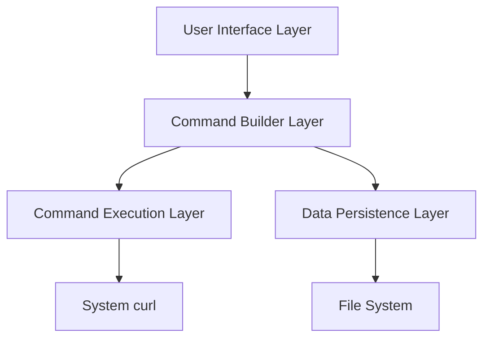

# Terminal Visual Curl (TVRL) - Design Document

## 1. Project Overview

### 1.1 Purpose
TVRL (Terminal Visual Curl) is a terminal-based UI application that provides a visual interface for building curl commands. Unlike Postman or Insomnia which abstract away the underlying HTTP requests, TVRL focuses on making curl itself more accessible through visual aids while preserving the power and flexibility of the curl command line tool.

### 1.2 Goals
- Create an intuitive terminal UI for building curl commands visually
- Show the actual curl command in real-time as users make selections
- Provide visual aids like checkboxes, dropdowns, and text fields for curl options
- Enable environment variable substitution and secure secret management
- Allow users to save, copy, or directly execute the generated commands
- Maintain the full power and flexibility of curl without abstraction

### 1.3 Target Users
- Developers who use curl but want visual assistance for complex commands
- API testers who prefer working directly with curl commands
- DevOps engineers who need to create, save, and share curl commands
- Curl users who want to avoid memorizing all flags and options

## 2. System Architecture

### 2.1 High-Level Architecture



### 2.2 Core Components

#### 2.2.1 User Interface Layer
- Built with ratatui
- Provides visual components for building curl commands
- Displays the generated curl command in real-time
- Shows execution results when commands are run

#### 2.2.2 Command Builder Layer
- Manages the state of all curl options and parameters
- Generates the curl command string based on user selections
- Performs environment variable substitution
- Validates command correctness

#### 2.2.3 Command Execution Layer
- Executes the generated curl command when requested
- Captures and displays command output
- Provides execution history

#### 2.2.4 Data Persistence Layer
- Saves and loads curl command templates
- Manages environment variables and secrets
- Stores command history

## 3. Features and Components

### 3.1 Command Building

#### 3.1.1 URL and Method Configuration
- URL input with environment variable support (e.g., `{{base_url}}/api/endpoint`)
- HTTP method selection (GET, POST, PUT, DELETE, etc.)
- Query parameter builder with enable/disable toggles

#### 3.1.2 Header Management
- Add/remove headers with enable/disable toggles
- Common header presets (Content-Type, Accept, Authorization)
- Environment variable support in header values

#### 3.1.3 Request Body Options
- Text input for raw body data
- Form data builder
- File upload selection
- Content-Type selection

#### 3.1.4 Curl Options Organization

The curl command has over 200 different options, making organization critical for usability. Options will be organized into logical categories with clear labeling and search functionality.

##### Option Categories

1. **Basic Options**
   - `-v, --verbose`: Make the operation more talkative
   - `-s, --silent`: Silent mode
   - `-S, --show-error`: Show error even when silent
   - `-i, --include`: Include protocol response headers in the output
   - `-I, --head`: Show document info only

2. **Request Options**
   - `-X, --request <method>`: HTTP method to use
   - `-d, --data <data>`: HTTP POST data
   - `--data-binary <data>`: HTTP POST binary data
   - `--data-urlencode <data>`: HTTP POST data url encoded
   - `-F, --form <name=content>`: Specify multipart MIME data

3. **Authentication Options**
   - `-u, --user <user:password>`: Server user and password
   - `--basic`: Use HTTP Basic Authentication
   - `--digest`: Use HTTP Digest Authentication
   - `--ntlm`: Use HTTP NTLM authentication
   - `--oauth2-bearer <token>`: OAuth 2 Bearer Token

4. **Connection Options**
   - `-k, --insecure`: Allow insecure server connections
   - `--connect-timeout <seconds>`: Maximum time allowed for connection
   - `--max-time <seconds>`: Maximum time allowed for the transfer
   - `-4, --ipv4`: Resolve names to IPv4 addresses
   - `-6, --ipv6`: Resolve names to IPv6 addresses

5. **Header Options**
   - `-H, --header <header/@file>`: Pass custom header(s) to server
   - `-A, --user-agent <name>`: Send User-Agent <name> to server
   - `-e, --referer <URL>`: Referer URL
   - `-b, --cookie <data|filename>`: Send cookies from string/file
   - `-c, --cookie-jar <filename>`: Write cookies to <filename> after operation

6. **SSL/TLS Options**
   - `--cacert <file>`: CA certificate to verify peer against
   - `--cert <certificate>`: Client certificate file
   - `--key <key>`: Private key file name
   - `--ciphers <list>`: SSL ciphers to use
   - `--tls-max <VERSION>`: Set maximum allowed TLS version

7. **Proxy Options**
   - `-x, --proxy <[protocol://][user:password@]proxyhost[:port]>`: Use proxy
   - `--proxy-basic`: Use Basic authentication on the proxy
   - `--proxy-digest`: Use Digest authentication on the proxy
   - `--noproxy <no-proxy-list>`: List of hosts which do not use proxy
   - `-p, --proxytunnel`: Operate through an HTTP proxy tunnel (using CONNECT)

8. **Output Options**
   - `-o, --output <file>`: Write to file instead of stdout
   - `-O, --remote-name`: Write output to a file named as the remote file
   - `-J, --remote-header-name`: Use the header-provided filename
   - `--create-dirs`: Create necessary local directory hierarchy
   - `-w, --write-out <format>`: Use output FORMAT after completion

##### UI Representation

Each category will be represented in the UI as:

- Collapsible sections to manage screen space
- Search functionality to quickly find specific options
- Tooltips showing detailed descriptions of each option
- Visual indicators for commonly used options
- Ability to mark favorites for quick access

##### Option Complexity Management

Options will be presented in three tiers:

1. **Basic Tier**: Most common options visible by default
2. **Advanced Tier**: More specialized options, collapsed by default
3. **Expert Tier**: Rarely used or complex options, accessible via search or dedicated expert mode

This tiered approach prevents overwhelming users while still providing access to curl's full power.

### 3.2 Command Management

#### 3.2.1 Command Templates
- Save frequently used commands as templates
- Organize templates in categories
- Export/import templates

#### 3.2.2 Command History
- Automatic logging of executed commands
- Ability to restore commands from history
- Search and filtering capabilities

### 3.3 Environment Management

#### 3.3.1 Environment Variables
- Named environments (Development, Staging, Production)
- Key-value pairs for each environment
- Real-time variable substitution in the command preview

#### 3.3.2 Secret Management
- Secure storage of sensitive values (API keys, passwords)
- Encryption of secrets at rest
- Masking of secrets in the UI and command history

### 3.4 Command Execution

#### 3.4.1 Execution Options
- Execute command directly from the UI
- Copy command to clipboard
- Save command to a script file

#### 3.4.2 Output Display
- Terminal-like output view
- Response headers and body display
- Execution time and status information

## 4. Data Models and Storage

### 4.1 Data Models

#### 4.1.1 CurlCommand
```rust
struct CurlCommand {
    id: String,
    name: String,
    description: Option<String>,
    url: String,
    method: Option<HttpMethod>,
    headers: Vec<Header>,
    query_params: Vec<QueryParam>,
    body: Option<RequestBody>,
    options: Vec<CurlOption>,
    created_at: DateTime<Utc>,
    updated_at: DateTime<Utc>,
}

struct Header {
    id: String,
    key: String,
    value: String,
    enabled: bool,
}

struct QueryParam {
    id: String,
    key: String,
    value: String,
    enabled: bool,
}

enum RequestBody {
    None,
    Raw(String),
    FormData(Vec<FormDataItem>),
    Binary(PathBuf),
}

struct CurlOption {
    id: String,
    flag: String,         // e.g., "-v", "--location"
    value: Option<String>, // Some options have values, others are just flags
    enabled: bool,
}
```

#### 4.1.2 CommandTemplate
```rust
struct CommandTemplate {
    id: String,
    name: String,
    description: Option<String>,
    command: CurlCommand,
    category: Option<String>,
    created_at: DateTime<Utc>,
    updated_at: DateTime<Utc>,
}
```

#### 4.1.3 Environment
```rust
struct Environment {
    id: String,
    name: String,
    variables: Vec<EnvironmentVariable>,
    created_at: DateTime<Utc>,
    updated_at: DateTime<Utc>,
}

struct EnvironmentVariable {
    id: String,
    key: String,
    value: String,
    is_secret: bool,
}
```

### 4.2 Storage Format

#### 4.2.1 File Structure
```
~/.config/tvrl/
├── config.toml       # Application configuration
├── templates/        # Command templates
│   ├── api.json
│   └── tools.json
├── environments/     # Environment definitions
│   ├── development.json
│   ├── staging.json
│   └── production.json
├── secrets/          # Encrypted secrets
│   └── secrets.enc
└── history/          # Command history
    └── history.json
```

#### 4.2.2 Configuration File (TOML)
```toml
[general]
default_environment = "development"
theme = "dark"
curl_path = "/usr/bin/curl"

[ui]
layout = "horizontal"
show_command_preview = true
show_line_numbers = true

[execution]
save_history = true
max_history_items = 100
```

#### 4.2.3 Command Templates (JSON)
```json
{
  "id": "template_123456",
  "name": "API Authentication",
  "description": "Template for API authentication requests",
  "category": "Authentication",
  "command": {
    "url": "https://{{base_url}}/api/auth",
    "method": "POST",
    "headers": [
      {
        "id": "header_1",
        "key": "Content-Type",
        "value": "application/json",
        "enabled": true
      }
    ],
    "body": {
      "type": "raw",
      "content": "{\"username\": \"{{username}}\", \"password\": \"{{password}}\"}"
    },
    "options": [
      {
        "id": "opt_1",
        "flag": "-v",
        "value": null,
        "enabled": true
      },
      {
        "id": "opt_2",
        "flag": "--max-time",
        "value": "30",
        "enabled": true
      }
    ]
  },
  "created_at": "2023-01-01T00:00:00Z",
  "updated_at": "2023-01-02T00:00:00Z"
}
```

#### 4.2.4 Environments (JSON)
```json
{
  "id": "env_dev",
  "name": "Development",
  "variables": [
    {
      "id": "var_1",
      "key": "base_url",
      "value": "http://localhost:3000",
      "is_secret": false
    },
    {
      "id": "var_2",
      "key": "api_key",
      "value": "dev_key_123",
      "is_secret": true
    }
  ],
  "created_at": "2023-01-01T00:00:00Z",
  "updated_at": "2023-01-01T00:00:00Z"
}
```

### 4.3 Secret Management

#### 4.3.1 Encryption Approach
- Use of system keyring when available
- Fallback to file-based encryption using a master password
- AES-256-GCM encryption for secrets at rest

#### 4.3.2 Secret Storage Format
```json
{
  "version": 1,
  "algorithm": "aes-256-gcm",
  "secrets": {
    "env_dev": {
      "api_key": {
        "iv": "base64_encoded_iv",
        "tag": "base64_encoded_tag",
        "data": "base64_encoded_encrypted_data"
      }
    },
    "env_prod": {
      "api_key": {
        "iv": "base64_encoded_iv",
        "tag": "base64_encoded_tag",
        "data": "base64_encoded_encrypted_data"
      }
    }
  }
}
```

## 5. User Interface Design

### 5.1 Layout

```
┌─────────────────────────────────────────────────────────────────────────┐
│ TVRL - Terminal Visual Curl                                   [Help][⚙] │
├─────────────────┬───────────────────────────────────────────────────────┤
│                 │ Command Builder                                        │
│                 │ ┌─────────────────────────────────────────────────────┐│
│ Templates       │ │ URL: https://{{base_url}}/api/users/{{user_id}}     ││
│                 │ └─────────────────────────────────────────────────────┘│
│ ▼ API           │ ┌─────────┐ ┌─────────┐ ┌─────────┐ ┌─────────────────┐│
│   ▶ Auth        │ │ Method  │ │ Headers │ │ Body    │ │ Curl Options    ││
│   ▶ Users       │ └─────────┘ └─────────┘ └─────────┘ └─────────────────┘│
│                 │ ┌─────────────────────────────────────────────────────┐│
│ ▼ Tools         │ │ Curl Options                                [+ Add] ││
│   ▶ Ping        │ │ ┌───┐ ┌────────────┐ ┌────────────────────────────┐ ││
│   ▶ DNS         │ │ │ ✓ │ │ -v         │ │ (verbose)                  │ ││
│                 │ │ └───┘ └────────────┘ └────────────────────────────┘ ││
│ ▼ Environments  │ │ ┌───┐ ┌────────────┐ ┌────────────────────────────┐ ││
│   ● Development │ │ │ ✓ │ │ -H         │ │ "Authorization: Bearer..." │ ││
│   ○ Production  │ │ └───┘ └────────────┘ └────────────────────────────┘ ││
│                 │ │ ┌───┐ ┌────────────┐ ┌────────────────────────────┐ ││
│ ▼ History       │ │ │ ✓ │ │ --max-time │ │ 30                         │ ││
│   ...           │ │ └───┘ └────────────┘ └────────────────────────────┘ ││
│                 │ └─────────────────────────────────────────────────────┘│
├─────────────────┴───────────────────────────────────────────────────────┤
│ Generated Command                                                        │
│ ┌─────────────────────────────────────────────────────────────────────┐ │
│ │ curl -v -H "Authorization: Bearer abc123" --max-time 30             │ │
│ │      https://api.example.com/users/123                              │ │
│ └─────────────────────────────────────────────────────────────────────┘ │
├─────────────────────────────────────────────────────────────────────────┤
│ [Copy Command] [Execute] [Save Template]                                 │
├─────────────────────────────────────────────────────────────────────────┤
│ Output                                                                   │
│ ┌─────────────────────────────────────────────────────────────────────┐ │
│ │ > GET /users/123 HTTP/1.1                                           │ │
│ │ > Host: api.example.com                                             │ │
│ │ > Authorization: Bearer abc123                                       │ │
│ │ ...                                                                  │ │
│ └─────────────────────────────────────────────────────────────────────┘ │
└─────────────────────────────────────────────────────────────────────────┘
```

### 5.2 Key Components

#### 5.2.1 Templates Panel
- List of saved command templates
- Organized by categories
- Quick access to frequently used commands

#### 5.2.2 Command Builder
- URL input with environment variable highlighting
- Method selection (GET, POST, PUT, etc.)
- Tabbed interface for headers, body, and curl options
- Visual toggles for curl flags and options

#### 5.2.3 Generated Command Display
- Real-time preview of the curl command being built
- Syntax highlighting
- Command wrapping for readability

#### 5.2.4 Output Panel
- Display of command execution results
- Raw curl output preservation
- Scrollable for viewing large responses

#### 5.2.5 Environment Selector
- Dropdown for selecting active environment
- Quick access to environment variables
- Visual indication of active environment

### 5.3 Keyboard Shortcuts

| Shortcut      | Action                    |
|---------------|---------------------------|
| Ctrl+N        | New command               |
| Ctrl+S        | Save template             |
| Ctrl+Enter    | Execute command           |
| Ctrl+C        | Copy command to clipboard |
| Ctrl+E        | Focus environment selector|
| Ctrl+H        | Toggle history panel      |
| Ctrl+Tab      | Cycle through tabs        |
| F1            | Show help                 |
| Esc           | Cancel/Close dialog       |

## 6. Implementation Considerations

### 6.1 Curl Command Generation

#### 6.1.1 Command Building
- Build curl commands based on user selections
- Handle special characters and escaping
- Support for all relevant curl options

Example curl command generation:
```rust
fn build_curl_command(command: &CurlCommand, environment: &Environment) -> String {
    let mut args = vec!["curl".to_string()];
    
    // Add enabled options
    for option in &command.options {
        if option.enabled {
            args.push(option.flag.clone());
            if let Some(value) = &option.value {
                let value_with_env = substitute_env_vars(value, environment);
                args.push(value_with_env);
            }
        }
    }
    
    // Add method if specified
    if let Some(method) = &command.method {
        if *method != HttpMethod::GET {
            args.push("-X".to_string());
            args.push(method.to_string());
        }
    }
    
    // Add headers
    for header in &command.headers {
        if header.enabled {
            let header_value = substitute_env_vars(&header.value, environment);
            args.push("-H".to_string());
            args.push(format!("{}: {}", header.key, header_value));
        }
    }
    
    // Add request body if applicable
    match &command.body {
        Some(RequestBody::Raw(content)) => {
            let content_with_env = substitute_env_vars(content, environment);
            args.push("-d".to_string());
            args.push(content_with_env);
        },
        Some(RequestBody::FormData(items)) => {
            for item in items {
                if item.enabled {
                    args.push("-F".to_string());
                    let value = substitute_env_vars(&item.value, environment);
                    args.push(format!("{}={}", item.key, value));
                }
            }
        },
        Some(RequestBody::Binary(path)) => {
            args.push("--data-binary".to_string());
            args.push(format!("@{}", path.display()));
        },
        None => {}
    }
    
    // Add URL with environment variable substitution
    let url = substitute_env_vars(&command.url, environment);
    args.push(url);
    
    // Format the command for display
    format_curl_command(&args)
}

fn format_curl_command(args: &[String]) -> String {
    // Format the command for better readability
    // This could include line breaks for long commands
    let mut formatted = String::new();
    let mut current_line_length = 0;
    let max_line_length = 80;
    
    for (i, arg) in args.iter().enumerate() {
        if i > 0 && current_line_length + arg.len() > max_line_length {
            formatted.push_str(" \\\n      ");
            current_line_length = 6;
        }
        
        if i > 0 {
            formatted.push(' ');
            current_line_length += 1;
        }
        
        // Handle arguments that need quoting
        if arg.contains(' ') && !arg.starts_with('"') && !arg.starts_with('\'') {
            formatted.push('"');
            formatted.push_str(arg);
            formatted.push('"');
            current_line_length += arg.len() + 2;
        } else {
            formatted.push_str(arg);
            current_line_length += arg.len();
        }
    }
    
    formatted
}
```

#### 6.1.2 Command Execution
- Execute curl as a subprocess
- Capture stdout and stderr
- Display raw output to the user
- Provide execution status and timing information

### 6.2 Environment Variable Substitution

#### 6.2.1 Variable Syntax
- Use `{{variable_name}}` syntax for variable references
- Support for default values with `{{variable_name:default}}`

#### 6.2.2 Substitution Logic
```rust
fn substitute_env_vars(input: &str, environment: &Environment) -> String {
    let mut result = input.to_string();
    
    // Regular expression to match {{variable}} patterns
    let re = Regex::new(r"\{\{([^:}]+)(?::([^}]+))?\}\}").unwrap();
    
    while let Some(captures) = re.captures(&result) {
        let full_match = captures.get(0).unwrap().as_str();
        let var_name = captures.get(1).unwrap().as_str();
        let default_value = captures.get(2).map(|m| m.as_str());
        
        // Look up variable in environment
        let replacement = environment.variables
            .iter()
            .find(|v| v.key == var_name)
            .map(|v| v.value.clone())
            .or_else(|| default_value.map(|s| s.to_string()))
            .unwrap_or_else(|| full_match.to_string());
        
        result = result.replacen(full_match, &replacement, 1);
    }
    
    result
}
```

### 6.3 Error Handling

#### 6.3.1 Command Validation
- Validate URL format
- Check for required options based on other selections
- Warn about potentially problematic combinations

#### 6.3.2 Execution Errors
- Handle curl command execution failures
- Display error messages from curl
- Provide suggestions for fixing common errors

### 6.4 Performance Considerations

#### 6.4.1 Asynchronous Command Execution
- Non-blocking UI during command execution
- Progress indication for long-running commands
- Cancellation support

#### 6.4.2 Large Output Handling
- Streaming output display
- Pagination for large responses
- Memory-efficient handling of binary responses

## 7. Future Enhancements

### 7.1 Potential Features
- Command chaining and scripting
- Response assertions and testing
- WebSocket/gRPC support via appropriate curl options
- Import/export compatibility with curl config files
- Plugin system for extensions

### 7.2 Performance Optimizations
- Command history search optimization
- Template categorization and tagging
- Lazy loading of templates and history

## 8. Development Roadmap

### 8.1 Phase 1: Core Functionality
- Basic UI implementation with ratatui
- Curl command building and real-time preview
- Command execution and output display
- Basic template management

### 8.2 Phase 2: Advanced Features
- Environment variable support
- Secret management
- Command history
- Configuration persistence

### 8.3 Phase 3: Polish and Extensions
- Improved UI and usability
- Advanced curl option support
- Import/export functionality
- Documentation and examples

## 9. Conclusion

The Terminal Visual Curl (TVRL) application will provide a powerful, terminal-based tool for building and executing curl commands. By focusing on making curl itself more accessible rather than abstracting it away, TVRL maintains the full power and flexibility of curl while adding visual aids to make it more user-friendly. The real-time command preview ensures users always know exactly what curl command they're building, and the ability to save templates and manage environments makes complex API interactions more manageable.